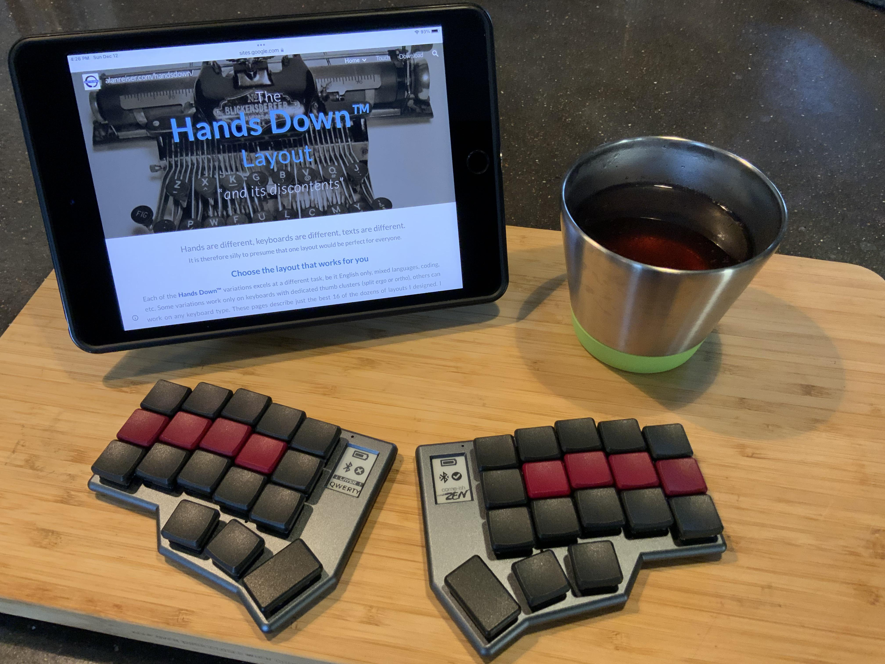

[**Hands Down**](http://handsdownlayout.com) [*Vibranium*](https://sites.google.com/alanreiser.com/handsdown/home/hands-down-neu#h.78qav8n932m7) (a.k.a Neu-vv) on a [Cornish-Zen](https://www.reddit.com/r/ErgoMechKeyboards/comments/reyulp/my_new_zen/) using just the github actions.

```
     ╭─────────────────────╮ ╭──────────────────────╮
ESC  │  X   W   M   G  "[  │ │  #$  .:  ']   J   B  │ BSP
TAB  │  S   C   N   T   K  | |  ,;   A   E   I   H  │ Tg(Num)
LSFT │  V   F   L   D   /* │ │  -+   U   O   Y   P  │ RSFT
     ╰──────╮  App BSP  R  │ │  SPC RET TAB  ╭──────╯
            ╰──────────────╯ ╰───────────────╯
```
[*Vibranium*](https://sites.google.com/alanreiser.com/handsdown/home/hands-down-neu#h.78qav8n932m7) is great with all the other [smart behaviors](https://sites.google.com/alanreiser.com/handsdown#h.nuloualcktlq), (and is not advized without some, esp. **`H` digraph combos** to send `TH`,`CH`,`WH`,`SH`,`GH`,`PH` bigrams). Currently I have most of the *essential* combos, and a ZMK take on [***Adaptive Keys***](https://sites.google.com/alanreiser.com/handsdown#h.ps4itorhjiq9) (using macros and sticky layers) and [***Linger Keys***](https://sites.google.com/alanreiser.com/handsdown#h.w8doktr0rzce) (using macros and hold-tap behaviors). They behave a bit differently than in QMK, but are quite usable. Eventually I hope to deploy a properly coded solution to these features so they have similar responsiveness as in QMK.

Currently building only for a Mac (hard coded for gui instead of ctrl, and some mac specific keycodes). My "Semantic Keys" feature for platform independence isn't yet fully fleshed out on my QMK implementations, and will reguire more invasive work for ZMK, so this too is for later.
